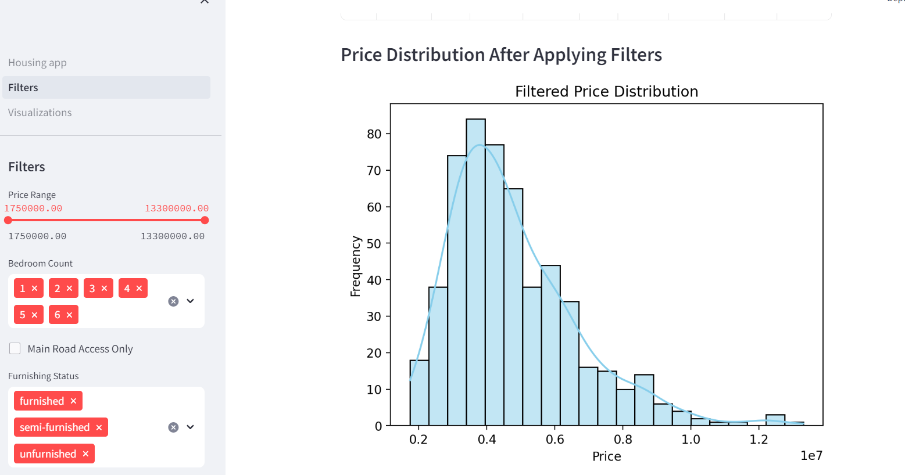

# Housing Dataset Analysis

## **Introduction**

Hello! This Streamlit application is for the Ames Housing dataset and runs through Docker. This dataset goes over house prices in Ames, Iowa and how different factors impact price. This data was downloaded from Kaggle and the link can be found on the first page of the project. 

## Running the Project

**1. Requirements**

* Python 3.12
* Streamlit (pip install streamlit)
* Pandas (pip install pandas)
* Numpy (pip install numpy)
* Matplotlib (pip install matplotlib)
* Seaborn (pip install seaborn) 
* Scikit-learn (pip install scikit-learn)

**2. Running with Docker**

(Assuming you have Docker installed)

* Build the Docker image:

```docker build -t my_streamlit_app  .```

* Run the container:

```docker run -p 8501:8501 my_streamlit_app```

*Important note when launching the program it may launch as 0.0.0.:8501 and not work. If you change it the code listed before the application should launch. 

Open http://localhost:8501 in your web browser to access the Streamlit app.

**3. What to Expect**
This project included two pages, the first one is called Filters and has ways for the data to be filter, to see the different impacts that different characteristics have on the price.



In addition, the second page is called Visualization.


A few of the visualizations that you can expect to find is the area of the house compared to cost, as seen above and the number of bedrooms in the house. These visuals help exmaine the individual impact that different characters have on the cost of a house


**4. Input welcome** 
Part of the assignment for this project was to implement a validation curve for the housing project. Despite my best efforts and AI, I wasn't able to get my validation code to work. I have included a picture of my code to see if anyone could find the error!

[CVE](Pictures/CVE.png)

## Conclusions

* The biggest impact of price was the number of bedrooms 

* There are outliers in the dataset

* Having the house pre-furnished did not have as big an impact on the price as orginally assumed 
 

cd housing
 docker run -p 8501:8501 my_housing_app