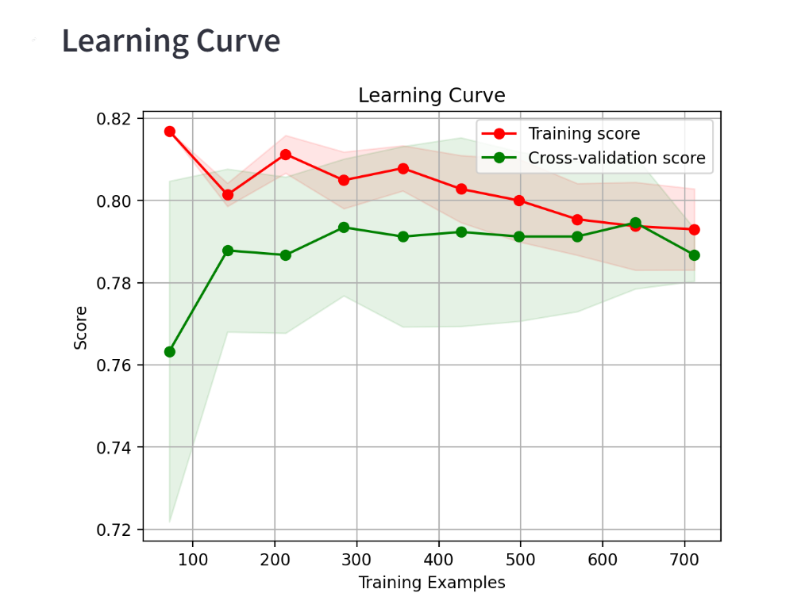

# Titanic Dataset Analysis

## **Introduction**

Hello! This Streamlit application runs through Docker and shows the classifications and visualizations of Titanic passengers survival. This data was downloaded from Kaggle and the link can be found on the first page of the project. 

## Running the Project

**1. Requirements**

* Python 3.12
* Streamlit (pip install streamlit)
* Pandas (pip install pandas)
* Numpy (pip install numpy)
* Matplotlib (pip install matplotlib)
* Seaborn (pip install seaborn) 
* Scikit-learn (pip install scikit-learn)

**2. Running with Docker**

(Assuming you have Docker installed)

* Build the Docker image:

```docker build -t my_streamlit_app  .```

* Run the container:

```docker run -p 8501:8501 my_streamlit_app```

*Important note when launching the program it may launch as 0.0.0.:8501 and not work. If you change it the code listed before the application should launch. 

Open http://localhost:8501 in your web browser to access the Streamlit app.

**3. What to Expect**
This project included two pages, the first one is called classifications and has the models that were used for classifying the data. This page also has method of filtering the data as seen below. 


In addition, to being able to filter the general data, there is also a way to filter by age. 


The second page is titled visualization. A few of the visualizations that you can expect to find are class, age, gender, fares and embarkation. These visuals help provide an indepth understanding of what traits may have improved an individuals chance of surivial 


**4. Learning Curve**
I have added a learning curve to my Titanic Dataset to show the difference between the training score and the cross validation score. 



## Conclusions

* Individuals that embarked from cherbourg France had the highest rate of survival.

* individuals that boarded at Southhamptons, UK had the lowest survival rate

* Younger people had a higher rate of survival 

* The more money that was spent on the ticket the more likely that person was to survive 